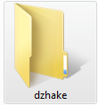

# Bab-be-u-modding-guide
I hope this will help you create your own bab be u mod.
## How to add your sprite
### If you are making object sprite:
Put your sprite in `assets/sprites`. You can put it in any folder, i for guide will new one, and call it `dzhake`

